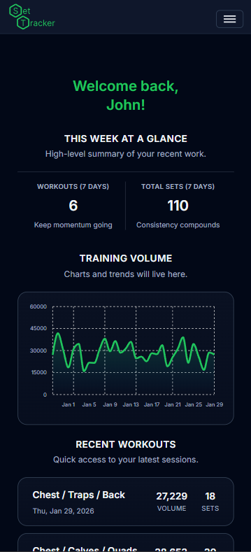
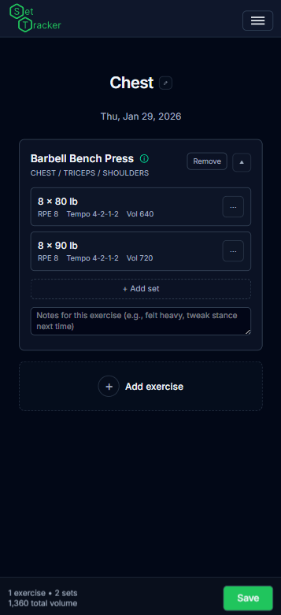
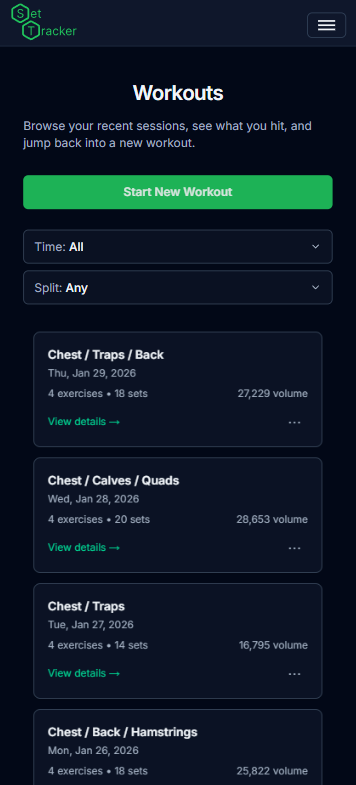

# SetTracker

SetTracker is a full-stack workout logging application built as a **production-quality portfolio project**. It enables lifters to log workouts quickly (exercises, sets, notes), review training history, and analyze training volume and muscle group distribution over time.

**Live App:** https://app.set-tracker.com  
**API:** https://api.set-tracker.com

---

## Try the Demo

To explore SetTracker without creating an account:

1. Visit https://app.set-tracker.com
2. Click **“Try the demo”** on the login screen

The demo account automatically seeds realistic, up-to-date workout data
so charts and dashboards are fully populated without actually having to make an account.

---

## Features

- **Dashboard & analytics**
  - Training volume trends over time
  - Muscle group breakdowns (primary vs secondary)
- **Workout logging**
  - Create and update workout sessions
  - Add/remove exercises and sets
  - Persist and reload sessions
- **Exercise catalog**
  - Browse/search exercises and add them to a session
  - Supports global exercise entries and optional user-specific exercise entries
- **Authentication**
  - Register / Login / Logout
  - **Email verification**
  - **Password reset**
  - Session security using **HttpOnly cookies** (access + refresh tokens)
- **Responsive UI**
  - Mobile-first layouts for core pages (ongoing refinements)

---

## Screenshots

### Dashboard



### Charts


### Dailylog



### Workouts



### Login


---

## Tech Stack

- **Frontend:** React + Next.js 16 (App Router), TypeScript, Tailwind CSS
- **Backend:** Node.js, Express, TypeScript, MongoDB (Mongoose)
- **Auth/Security:** JWT access/refresh tokens + bcrypt, HttpOnly cookies
- **Infrastructure:** Vercel (frontend), Render (backend), MongoDB Atlas (database)
- **Email:** SMTP (planned migration to Resend)

---

## Architecture

A high-level diagram and explanation are available here:

- [`docs/architecture.md`](docs/architecture.md)

Deployment details and environment configuration:

- [`docs/deployment.md`](docs/deployment.md)
- [`docs/env.md`](docs/env.md)

Product scope and roadmap:

- [`docs/product.md`](docs/product.md)

---

## Running Locally (Developer Setup)

### 1) Install dependencies

From the repo root, install per package (or use your preferred workspace flow):

```bash
cd frontend && npm install
cd ../backend && npm install
```

### 2) Configure environment variables

Create local env files from examples (do not commit real secrets):

- `frontend/.env.local`
- `backend/.env`

Reference:

- [`docs/env.md`](docs/env.md)

### 3) Run the apps

Frontend:

```bash
cd frontend
npm run dev
# http://localhost:3000
```

Backend:

```bash
cd backend
npm run dev
# http://localhost:5000
```

Note: In production, the frontend and API are hosted on separate subdomains:
https://app.set-tracker.com
https://api.set-tracker.com

---

## Release

See [`CHANGELOG.md`](docs/CHANGELOG.md) for versioned changes.  
Current release target: **v1.0.0**.

---

## Documentation

- Architecture: [`docs/architecture.md`](docs/architecture.md)
- Deployment: [`docs/deployment.md`](docs/deployment.md)
- Environment variables: [`docs/env.md`](docs/env.md)
- Product scope / roadmap: [`docs/product.md`](docs/product.md)

---

## Legal

- [Privacy Policy](docs/PRIVACY.md)
- [Terms of Service](docs/TERMS.md)
